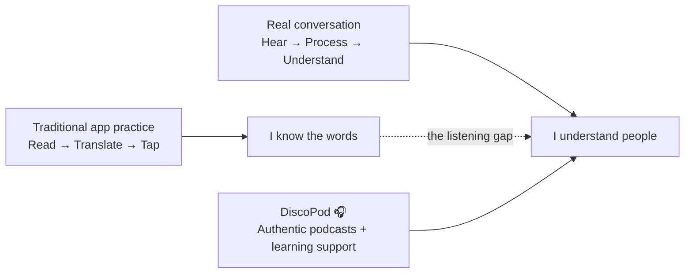

# DiscoPod 🎧

> **You can recognize the sentence. But can you catch it at 1× speed?**
>
> **DiscoPod turns podcasts into an English ↔ Chinese listening-learning experience — so learners can train with the language people actually speak.**

## Problems & Goals

### The Problem: Language Learners Study With Their Eyes — Then Struggle With Their Ears

Language-learning apps have made it easier than ever to build vocabulary, practice grammar, and keep a daily learning streak. But real conversations do not arrive as flashcards, word banks, or sentences you can reread.

They arrive as **sound** — fast, continuous, accented, contextual, and gone the moment it is spoken.

That creates a frustrating gap for many learners:

> **“I know these words when I see them. Why can’t I understand them when someone actually says them?”**

This is not a niche problem. Duolingo itself describes listening as **one of the most challenging language skills**, and has expanded its courses with dedicated listening exercises and short, podcast-like DuoRadio lessons.[1][2] The opportunity is therefore not to argue that existing apps ignore listening. It is to go one step further: **move listening from a supporting exercise to the center of the learning experience.**

### Why Podcasts?

Podcasts are almost the opposite of textbook language. They contain **real pacing, real pronunciation, real accents, real vocabulary, and real ideas** — while still letting learners pause, replay, slow down, and choose topics they genuinely care about.

Research increasingly supports this approach. A 2024 mixed-methods study followed **60 B2 English learners** for 10 weeks and found that learners using mobile extensive listening and podcasting showed significant improvements not only in **listening comprehension, but also in speaking and critical-thinking skills**.[3] A 2025 systematic review covering **26 podcast-listening studies published from 2020–2024** likewise concluded that podcast-based learning consistently improves listening performance and motivation, especially when combined with extensive listening and metacognitive learning strategies.[4]

For our local context, the pain is especially tangible: a 2024 study of **304 university EFL learners in Taiwan** documented listening-comprehension difficulties across proficiency levels, reinforcing that passing vocabulary and grammar exercises does not automatically make authentic spoken English easy to process.[5]

**The insight behind DiscoPod is simple:**

> Text can teach you what a language **looks like**.  
> Podcasts teach you what a language **feels like in the real world**.

### Why English ↔ Chinese?

We are starting with **English and Chinese** because the demand is already massive in both directions.

Duolingo's 2025 Language Report, based on activity from millions of learners worldwide, found that **English was the #1 language studied in 154 countries — 79% of all countries in its dataset**. Chinese ranked **#8 globally**, was the **fastest-growing language** in 12 major markets including France, Germany, Brazil, Mexico, South Korea, and Thailand, and was the **second-fastest-growing language in the United States**.[6]

That creates a natural two-sided use case for DiscoPod:

- **Chinese-speaking learners → English:** train the ear for natural English used in school, work, travel, interviews, media, and international conversations.
- **English-speaking learners → Chinese:** move beyond memorizing characters and textbook phrases toward recognizing tones, rhythm, vocabulary, and meaning in authentic Mandarin speech.

Instead of asking learners to consume generic practice material, DiscoPod can let them learn through topics they already care about — **technology, business, pop culture, sports, science, storytelling, news, or anything with a podcast feed.** Interest becomes the motivation loop.

### The Market Gap: Lessons Teach the Language. We Want to Train the Ear.

We are not trying to build another all-purpose language course. Existing products already solve important parts of language learning extremely well.

| Product                                | What It Does Well                                                                                                                                                      | The Gap DiscoPod Targets                                                                                                                                                                  |
| -------------------------------------- | ---------------------------------------------------------------------------------------------------------------------------------------------------------------------- | ----------------------------------------------------------------------------------------------------------------------------------------------------------------------------------------- |
| **Duolingo**                           | Excellent gamification, structured curricula, bite-sized reading, writing, speaking, and listening practice; DuoRadio adds short podcast-like listening lessons.[1][2] | Learning is still primarily organized around a designed course path and controlled lesson content. DiscoPod starts with **authentic podcasts and listening itself**.                      |
| **LingQ**                              | Strong immersion platform with real-world books, podcasts, videos, transcripts, vocabulary tools, and 5M+ learners.[7]                                                 | Broad content immersion across many media types. DiscoPod can be much more opinionated: **podcast-first, listening-first, and optimized specifically for the English ↔ Chinese journey.** |
| **FluentU**                            | Turns authentic videos into language lessons using subtitles, word explanations, replay, and quizzes.[8]                                                               | Primarily video-first. DiscoPod is designed for the **audio moments where learners cannot depend on the screen** — commuting, walking, exercising, or simply training their ears.         |
| **Spotify / Apple Podcasts / YouTube** | Near-infinite authentic content and world-class media discovery.                                                                                                       | They help users **consume** podcasts, not systematically **learn a language from them**.                                                                                                  |
| **DiscoPod**                           | **Turn something you already want to listen to into something you can learn from.**                                                                                    | Bridge authentic podcast consumption and structured language learning in one listening-first experience.                                                                                  |

The key distinction is not **“other apps use text, DiscoPod uses audio.”** Modern language apps already use audio. The distinction is:

> **Most language apps start with a lesson and add listening. DiscoPod starts with listening and builds the lesson around it.**

### DiscoPod's Goal

Our goal is to make the jump from **“I am studying English/Chinese” to “I can naturally follow English/Chinese” and feel achievable EVERY DAY. The product provides a language-learning solution that is easy to use and affordable/accessible to end-users. The learner with growing listening comprehension is cultivated by the simple user interface from our designed platform. 

A DiscoPod learning loop should be simple:

DiscoPod is guided by four product principles:

**🎧 Listening first, not text first.**  
The primary action is listening. Transcripts, translations, vocabulary, and explanations exist to get the learner back to the audio — not replace it.

**🌏 Authentic language, not only classroom language.**  
Learners should hear how English and Chinese are actually spoken: connected speech, tones, fillers, pacing, accents, idioms, and context.

**❤️ Interest is the curriculum.**  
A learner who loves startups should be able to learn from startup podcasts. A basketball fan should learn from basketball. A pop-culture fan should learn from pop culture. The content is already compelling; DiscoPod adds the learning layer.

**🧠 Comprehension before perfection.**  
The first win is not memorizing every word. It is the moment a learner replays a sentence that sounded like noise five minutes ago — and suddenly understands it. By matching learners with real podcast content at the users' exact listening level in real time, this AI companion seamlessly integrates language practice into their daily lives.

### What Success Looks Like

For a hackathon demo, our north-star moment is deliberately simple:

> A learner opens an English or Chinese podcast that initially feels **too fast**, uses DiscoPod to understand the difficult moments, listens again — and realizes: **“Wait. I can hear it now.”**

That is the experience we want to build toward.

---

### References

1. Duolingo, **Listening Practice in Another Language: Tips from Duolingo** — https://blog.duolingo.com/covering-all-the-bases-duolingos-approach-to-listening-skills/
2. Duolingo, **DuoRadio is Duolingo's New Tool for Practicing Listening Skills** — https://blog.duolingo.com/duoradio-listening-practice/
3. _Thinking Skills and Creativity_ (2024), **Enhancing language proficiency through mobile extensive listening and podcasting: A multifaceted approach to metacognition and critical thinking** — https://doi.org/10.1016/j.tsc.2024.101656
4. Niode, Nurwati & Ayuba (2025), **Trend in Using Podcasts for Students Listening Skills: Systematic Literature Review** — https://doi.org/10.61455/sicopus.v4i01.502
5. Huang (2024), **Exploring gender and language proficiency variations in English Listening Comprehension Difficulties among college EFL learners** — https://doi.org/10.29140/lea.v7n1.1243
6. Duolingo, **2025 Duolingo Language Report** — https://blog.duolingo.com/2025-duolingo-language-report/
7. LingQ — https://www.lingq.com/en/
8. FluentU — https://www.fluentu.com/
