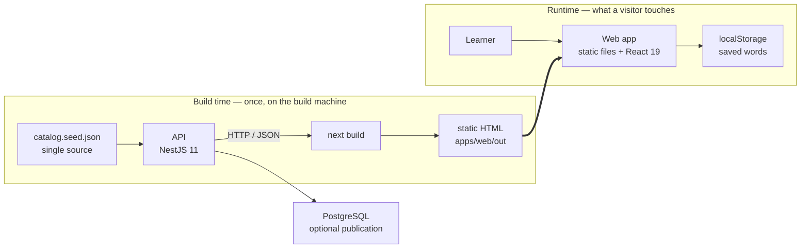
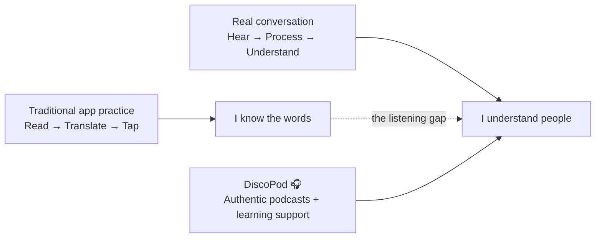

# DiscoPod 🎧

> **You can recognize the sentence. But can you catch it at 1× speed?**
>
> **DiscoPod turns podcasts into an English ↔ Chinese listening-learning experience — so learners can train with the language people actually speak.**
> ## Try it

**Live app → https://discopod-web.onrender.com/**

Pick a language pair on the landing page, then open any episode to see the
transcript-first player and the ranked "start here" list.

You do not need the API to be awake to evaluate the site. The deployed pages are
statically generated and make no calls to a backend — see
[Architecture](#architecture) for why.


## Architecture

DiscoPod is an npm workspaces monorepo with two applications. The relationship
between them is unusual and is the central design decision: **the web app talks
to the API at build time, and never at runtime.**



`apps/web/scripts/build.mjs` starts the API on a free port, waits for
`/api/health`, runs `next build` against it, and terminates it. The catalogue
crosses the wire exactly once, during that build. The deployed site holds no API
URL, so it never waits on the API's cold start. See
[ADR 0002](docs/adr/0002-fetch-the-catalogue-at-build-time.md).


## Problems & Goals

### The Problem: Language Learners Study With Their Eyes — Then Struggle With Their Ears

Language-learning apps have made it easier than ever to build vocabulary, practice grammar, and keep a daily learning streak. But real conversations do not arrive as flashcards, word banks, or sentences you can reread.

They arrive as **sound** — fast, continuous, accented, contextual, and gone the moment it is spoken.

That creates a frustrating gap for many learners:

> **“I know these words when I see them. Why can’t I understand them when someone actually says them?”**

This is not a niche problem. Duolingo itself describes listening as **one of the most challenging language skills**, and has expanded its courses with dedicated listening exercises and short, podcast-like DuoRadio lessons.[1][2] The opportunity is therefore not to argue that existing apps ignore listening. It is to go one step further: **move listening from a supporting exercise to the center of the learning experience.**



### Why Podcasts?

Podcasts are almost the opposite of textbook language. They contain **real pacing, real pronunciation, real accents, real vocabulary, and real ideas** — while still letting learners pause, replay, slow down, and choose topics they genuinely care about.

Research increasingly supports this approach. A 2024 mixed-methods study followed **60 B2 English learners** for 10 weeks and found that learners using mobile extensive listening and podcasting showed significant improvements not only in **listening comprehension, but also in speaking and critical-thinking skills**.[3] A 2025 systematic review covering **26 podcast-listening studies published from 2020–2024** likewise concluded that podcast-based learning consistently improves listening performance and motivation, especially when combined with extensive listening and metacognitive learning strategies.[4]

For our local context, the pain is especially tangible: a 2024 study of **304 university EFL learners in Taiwan** documented listening-comprehension difficulties across proficiency levels, reinforcing that passing vocabulary and grammar exercises does not automatically make authentic spoken English easy to process.[5]

**The insight behind DiscoPod is simple:**

> Text can teach you what a language **looks like**.  
> Podcasts teach you what a language **feels like in the real world**.

### Why English ↔ Chinese?

We are starting with **English and Chinese** because the demand is already massive in both directions.

Duolingo's 2025 Language Report, based on activity from millions of learners worldwide, found that **English was the #1 language studied in 154 countries — 79% of all countries in its dataset**. Chinese ranked **#8 globally**, was the **fastest-growing language** in 12 major markets including France, Germany, Brazil, Mexico, South Korea, and Thailand, and was the **second-fastest-growing language in the United States**.[6]

That creates a natural two-sided use case for DiscoPod:

- **Chinese-speaking learners → English:** train the ear for natural English used in school, work, travel, interviews, media, and international conversations.
- **English-speaking learners → Chinese:** move beyond memorizing characters and textbook phrases toward recognizing tones, rhythm, vocabulary, and meaning in authentic Mandarin speech.

Instead of asking learners to consume generic practice material, DiscoPod can let them learn through topics they already care about — **technology, business, pop culture, sports, science, storytelling, news, or anything with a podcast feed.** Interest becomes the motivation loop.

### The Market Gap: Lessons Teach the Language. We Want to Train the Ear.

We are not trying to build another all-purpose language course. Existing products already solve important parts of language learning extremely well.

| Product                                | What It Does Well                                                                                                                                                      | The Gap DiscoPod Targets                                                                                                                                                                  |
| -------------------------------------- | ---------------------------------------------------------------------------------------------------------------------------------------------------------------------- | ----------------------------------------------------------------------------------------------------------------------------------------------------------------------------------------- |
| **Duolingo**                           | Excellent gamification, structured curricula, bite-sized reading, writing, speaking, and listening practice; DuoRadio adds short podcast-like listening lessons.[1][2] | Learning is still primarily organized around a designed course path and controlled lesson content. DiscoPod starts with **authentic podcasts and listening itself**.                      |
| **LingQ**                              | Strong immersion platform with real-world books, podcasts, videos, transcripts, vocabulary tools, and 5M+ learners.[7]                                                 | Broad content immersion across many media types. DiscoPod can be much more opinionated: **podcast-first, listening-first, and optimized specifically for the English ↔ Chinese journey.** |
| **FluentU**                            | Turns authentic videos into language lessons using subtitles, word explanations, replay, and quizzes.[8]                                                               | Primarily video-first. DiscoPod is designed for the **audio moments where learners cannot depend on the screen** — commuting, walking, exercising, or simply training their ears.         |
| **Spotify / Apple Podcasts / YouTube** | Near-infinite authentic content and world-class media discovery.                                                                                                       | They help users **consume** podcasts, not systematically **learn a language from them**.                                                                                                  |
| **DiscoPod**                           | **Turn something you already want to listen to into something you can learn from.**                                                                                    | Bridge authentic podcast consumption and structured language learning in one listening-first experience.                                                                                  |

The key distinction is not **“other apps use text, DiscoPod uses audio.”** Modern language apps already use audio. The distinction is:

> **Most language apps start with a lesson and add listening. DiscoPod starts with listening and builds the lesson around it.**

### DiscoPod's Goal

Our goal is to make the jump from **“I am studying English/Chinese” to “I can naturally follow English/Chinese” and feel achievable EVERY DAY. The product provides a language-learning solution that is easy to use and affordable/accessible to end-users. The learner with growing listening comprehension is cultivated by the simple user interface from our designed platform. 

A DiscoPod learning loop should be simple:


DiscoPod is guided by four product principles:

**🎧 Listening first, not text first.**  
The primary action is listening. Transcripts, translations, vocabulary, and explanations exist to get the learner back to the audio — not replace it.

**🌏 Authentic language, not only classroom language.**  
Learners should hear how English and Chinese are actually spoken: connected speech, tones, fillers, pacing, accents, idioms, and context.

**❤️ Interest is the curriculum.**  
A learner who loves startups should be able to learn from startup podcasts. A basketball fan should learn from basketball. A pop-culture fan should learn from pop culture. The content is already compelling; DiscoPod adds the learning layer.

**🧠 Comprehension before perfection.**  
The first win is not memorizing every word. It is the moment a learner replays a sentence that sounded like noise five minutes ago — and suddenly understands it. By matching learners with real podcast content at the users' exact listening level in real time, this AI companion seamlessly integrates language practice into their daily lives.

### What Success Looks Like

For a hackathon demo, our north-star moment is deliberately simple:

> A learner opens an English or Chinese podcast that initially feels **too fast**, uses DiscoPod to understand the difficult moments, listens again — and realizes: **“Wait. I can hear it now.”**

That is the experience we want to build toward.

### Frontend — `apps/web`

Next.js 16 and React 19. Podcast discovery, episode pages, the transcript-first
listening experience, vocabulary interaction, and learner-facing presentation
logic. Every route prerenders, so the production deployment is a static export.

### Backend — `apps/api`

NestJS 11. Catalogue access, difficulty profiles, suitability ranking,
`start-here` recommendations, and saved vocabulary.

Storage runs in memory or on PostgreSQL depending on `DATABASE_URL`. Unset is a
first-class mode, not a degraded one — it is what CI and the web build run. Set
is never a fallback: an unreachable database fails the boot rather than silently
reverting to memory. The catalogue itself always comes from
`catalog.seed.json`; PostgreSQL holds a *publication* of it, republished
whenever the seed's digest changes, never a second source of truth.
See [ADR 0011](docs/adr/0011-postgres-is-a-publication-of-the-seed.md).

### The language pair is the core model

DiscoPod does not have "a language". It has a **pair** — what the learner speaks
and what they are learning — and the pair is a route segment, not a preference.

Three distinctions the codebase enforces:

- **Learner-language text is `Localized`**, keyed by the learner's language:
  `profile.reason`, `learningGoal`, vocabulary meanings, question prompts, cue
  translations. Show-language text (titles, terms, examples, cue text) stays
  scalar. A missing key is an **exclusion, never a fallback to English** — a
  half-translated pair drops content rather than showing the learner a language
  they did not ask for. ([ADR 0003](docs/adr/0003-model-the-learner-language-pair.md))
- **Written form is not spoken language.** `LanguageTag` (`en` / `zh-Hant` /
  `zh-Hans`) governs text; `SpokenLanguage` (`en` / `cmn`) governs audio and
  speech-rate units. Traditional and Simplified are never converted between —
  the mapping is many-to-one and a guess.
  ([ADR 0006](docs/adr/0006-separate-spoken-language-from-written-form.md))
- **Speech rate carries its unit.** English is measured in words per minute,
  Mandarin in characters per minute. The unit travels with the value rather than
  being assumed where it is rendered.
  ([ADR 0004](docs/adr/0004-measure-speech-rate-in-a-declared-unit.md))

### What the ranking will and will not claim

Suitability ranking uses learnability characteristics the audio actually
produces: speech rate over the speech span, vocabulary coverage, speaker count,
slang load (register density) and accent load. Every ranked result carries a
plain-language `reason` shown to the learner; the system will not rank without
one.

The planned completion/engagement signal is **deliberately absent**. There is
not yet enough real listening data to compute it, and fabricating it is
prohibited in the project's own contributor rules rather than left to judgment.

The same principle governs generated text: machine-translated cue overlays are
labelled per episode and per language via `authoredBy: 'auto-translated'`, so the
interface can never present a machine translation as a verified one.
([ADR 0017](docs/adr/0017-english-overlay-from-machine-translation.md),
[ADR 0019](docs/adr/0019-auto-translated-is-an-episode-and-language-claim.md))

### Data and AI pipeline

The intended long-term pipeline:

```text
Podcast RSS / Content Source
        ↓
Episode Metadata
        ↓
Transcript / ASR
        ↓
Segmentation & Alignment
        ↓
Vocabulary / Translation / Learning Support
        ↓
Difficulty & Learnability Profiling
        ↓
Suitability Ranking
        ↓
Learner
```

Built today: catalogue modelling, transcript cues, vocabulary, difficulty
profiles, learnability-based ranking, and labelled machine-translated overlays.
Not built: automated RSS ingestion and an ASR stage. `apps/api/src/ingest/`
holds a vetted list of shows to ingest *from*; nothing reads it yet, and it is
explicitly not a second catalogue.


## Technology Stack

| Layer | Technology | Role |
| --- | --- | --- |
| Frontend | Next.js 16 | Web application and static generation |
| UI | React 19 | Interactive learner experience |
| UI Components | shadcn-style components + Base UI | Consistent interface components |
| Styling | Tailwind CSS 4 | Responsive styling |
| Backend | NestJS 11 | REST API and domain logic |
| Runtime | Node.js 22.13+ | Application runtime |
| Data | JSON seed files | Single source of catalogue data |
| Validation | class-validator / class-transformer | API request validation |
| Testing | Jest | API and integration testing |
| Containerization | Docker | Local full-stack development |
| Deployment | Render / Node-compatible hosts | Web and API hosting |

The root project requires Node `>=22.13.0 <25` and uses npm workspaces to manage
`apps/web` and `apps/api`.

The system intentionally avoids vendor-specific runtime dependencies. Both
applications run as ordinary Node processes, allowing deployment to containers,
VPS infrastructure, or compatible cloud platforms.
([ADR 0001](docs/adr/0001-decouple-from-cloudflare-and-add-nestjs-api.md))


## Execution

### Local development

Install dependencies from the repository root:

```bash
nvm use
npm ci --include=dev     # --include=dev matters: with NODE_ENV=production a
                         # plain `npm ci` drops the build toolchain
```

Start both applications:

```bash
npm run dev
```

```text
Web    → http://localhost:3000
API    → http://localhost:3001
```

The root development script starts the API first and waits for `/api/health`
before starting the web application — the same handshake the production build
makes. A page loaded before the API answers fails rather than rendering an empty
catalogue.

To run the applications separately:

```bash
npm run dev:web
npm run dev:api
```

### Verification

```bash
npm run lint
npm run typecheck
npm run build
npm test
```

The API test suite uses `TEST_DATABASE_URL` for PostgreSQL integration tests —
kept deliberately separate from `DATABASE_URL`, since the integration suite drops
the `public` schema. Without it, the database-dependent suite skips.

CI mirrors the deploy: same Node version, same install flags, lint, typecheck,
tests against a real PostgreSQL 17, both build modes, a smoke test of the API in
each storage mode, and assertions on the exported HTML.

### Docker

The full local stack:

```bash
docker compose up --build
```

```text
Web       :3000
API       :3001
Postgres  :5432
```

The API starts only once PostgreSQL reports healthy — an unreachable
`DATABASE_URL` is a boot failure by design, so waiting is correct and degrading
to memory would not be.

### Production / Deployment

`render.yaml` is a Render Blueprint deploying two services from this one
repository:

- **`discopod-web`** — the static export, served from a CDN.
- **`discopod-api`** — the NestJS process, health-checked at `/api/health`.

Path filters keep a web-only change from rebuilding the API. A change under
`apps/api` **does** rebuild the web service, because the catalogue and the
ranking are baked into the HTML at build time and would otherwise go stale
silently.

The deployed web service is given no API URL. This is deliberate: the site
cannot be made slow by a sleeping free-tier API instance.


## Current Limitations

DiscoPod is a functional product prototype, not a complete end-to-end AI podcast
learning platform. What follows is what is not built — and, where it matters,
why it was left unbuilt rather than approximated.

### 1. Content ingestion is not automated

RSS ingestion is not implemented. The catalogue is seeded from JSON rather than
continuously discovering and importing feeds. `apps/api/src/ingest/` holds a
vetted source list for that work; nothing reads it yet.

### 2. ASR is not integrated

Machine-translated cue overlays exist today and are labelled as such. What is
missing is the transcription stage: generating transcripts where a publisher
supplies none. Until that exists, the catalogue carries only episodes whose
transcripts can be evidenced.

### 3. Learner personalisation is limited by data, not by design

Ranking uses learnability characteristics only. The completion/engagement signal
is specified but not shipped, because there is no real listening data to compute
it from — and the project's rules forbid fabricating it. A shallower ranking that
is honest was preferred to a richer one that is invented.

### 4. Authentication and persistent learner profiles are incomplete

There is no learner identity or authentication; a placeholder identifier stands
in. In the deployed site, saved words are held in the browser's `localStorage` —
the API's saved-words endpoints exist and are backed by PostgreSQL, but the
static front end does not yet call them. Connecting the two is what learner
accounts unlock.

### 5. Audio and generated-content storage is a future layer

Object storage for cached audio and generated transcripts is planned, not
provisioned. The current architecture suits a prototype; large-scale ingestion
and AI-generated learning content will require it.

---

### References

1. Duolingo, **Listening Practice in Another Language: Tips from Duolingo** — https://blog.duolingo.com/covering-all-the-bases-duolingos-approach-to-listening-skills/
2. Duolingo, **DuoRadio is Duolingo's New Tool for Practicing Listening Skills** — https://blog.duolingo.com/duoradio-listening-practice/
3. _Thinking Skills and Creativity_ (2024), **Enhancing language proficiency through mobile extensive listening and podcasting: A multifaceted approach to metacognition and critical thinking** — https://doi.org/10.1016/j.tsc.2024.101656
4. Niode, Nurwati & Ayuba (2025), **Trend in Using Podcasts for Students Listening Skills: Systematic Literature Review** — https://doi.org/10.61455/sicopus.v4i01.502
5. Huang (2024), **Exploring gender and language proficiency variations in English Listening Comprehension Difficulties among college EFL learners** — https://doi.org/10.29140/lea.v7n1.1243
6. Duolingo, **2025 Duolingo Language Report** — https://blog.duolingo.com/2025-duolingo-language-report/
7. LingQ — https://www.lingq.com/en/
8. FluentU — https://www.fluentu.com/
