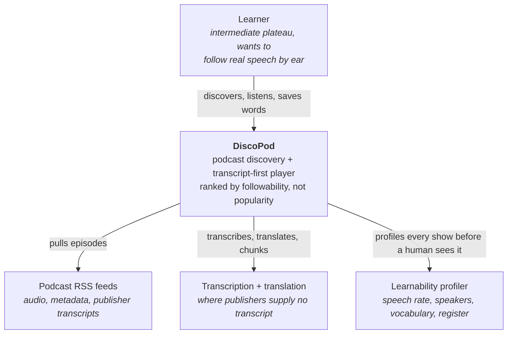
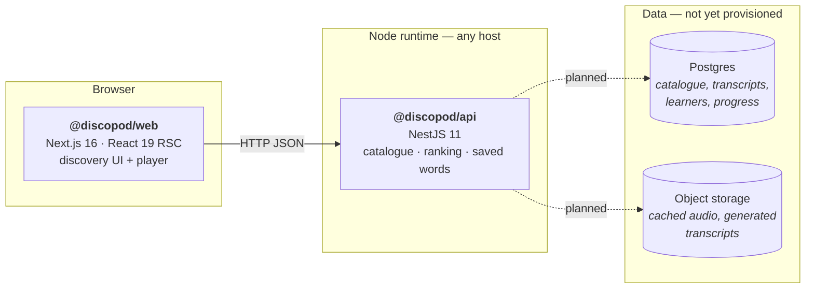

# DiscoPod — Architecture

Companion to [VISION.md](VISION.md). The vision says what the product is; this says
how the system is shaped to deliver it, and — just as important — what is *not* built
yet, so nobody mistakes a placeholder for a capability.

## Constraints that shaped this

1. **No platform lock-in.** The app must run on any Node host — a VPS, a container,
   Vercel, Fly, Railway. Nothing in the code may assume a single vendor's runtime or
   managed services.
2. **The backend is NestJS.** Domain logic lives in an explicitly-structured Node
   service, not in framework route handlers.
3. **The transcript is the interface.** Playback, transcript and word capture are one
   surface, which puts real latency requirements on transcript delivery.

## System context (C4 level 1)



## Containers (C4 level 2)



Both containers are plain Node processes. There is no edge runtime, no vendor SDK, and
no managed-service binding anywhere in the source — replacing the host is a deployment
change, not a code change.

## Repository layout

```
apps/
  web/          Next.js 16 app — discovery, episode pages, player
    app/        routes and global styles
    components/ shadcn-style UI on Base UI
    lib/        legacy demo catalogue (moves behind the API — see Migration)
  api/          NestJS 11 service
    src/catalog/     shows, episodes, difficulty profiles, suitability ranking
    src/vocabulary/  saved words with their audio context
    src/health/      liveness
docs/           vision, architecture, ADRs
```

npm workspaces. `npm run build` at the root builds both.

## The domain, and where it lives

| Concept | Owner | State today |
| --- | --- | --- |
| Show + difficulty profile | `api/src/catalog` | Modelled; seeded from the demo catalogue |
| Episode, transcript cues, vocabulary, quiz | `api/src/catalog` | Modelled and served |
| Suitability ranking | `CatalogService.rank` | Implemented — learnability half only |
| "Start here" pick with stated reason | `CatalogService.startHere` | Implemented |
| Saved words with audio context | `api/src/vocabulary` | Implemented, in-memory |
| Completion-by-level signal | — | **Not built.** Needs listening data |
| Ingestion from RSS | — | **Not built** |
| ASR + translation pipeline | — | **Not built** |
| Learner identity / auth | — | **Not built.** `x-learner-id` header placeholder |
| Persistence | — | **Not built.** In-memory adapter behind a port |

### Ranking

The vision calls for two signals: completion inside DiscoPod segmented by level, and a
model's judgement of learnability. Only the second is implementable before there are
users, so `CatalogService.rank` computes learnability alone:

```
suitability = 100 × (1 − (0.40·ratePenalty
                        + 0.30·coveragePenalty
                        + 0.20·speakerPenalty
                        + 0.10·registerPenalty))
```

Each penalty is normalised to 0–1 against the learner's level. The completion signal is
deliberately absent rather than approximated — a faked engagement signal would be
indistinguishable from the chart-based ranking the product exists to replace.

Every ranked result carries a `reason` string generated alongside the score, so the
"state the reason" principle is enforced by the return type, not by UI discipline.

### Persistence

`CatalogRepository` is an abstract class registered as a Nest provider; the in-memory
adapter is bound in `CatalogModule`. Swapping in Postgres means writing a second
adapter and changing one `useClass` line. No caller touches storage directly.

## How the web app gets the catalogue

`apps/api/src/catalog/data/catalog.seed.json` is the single source. `apps/web/lib/podcasts.ts`
is gone, and with it the duplication and the hand-written `match` percentages — cards now
show the suitability the API computes, with the `reason` behind it.

The fetch happens **at build time**, not at runtime. `apps/web/scripts/build.mjs` starts
`apps/api/dist/main.js` on a free ephemeral port, waits for `/api/health`, runs `next build`
against it with `CATALOG_API_URL` set, and stops it again. So the build exercises the real
HTTP contract while needing no network, and the deployed static site has no runtime
dependency on an API that sleeps. Full reasoning and the rejected alternatives are in
[ADR 0002](adr/0002-fetch-the-catalogue-at-build-time.md).

Inside `apps/web/lib`: `catalog-api.ts` is the HTTP client and the shape assertions,
`presentation.ts` holds what the API correctly refuses to return (the card palette, the
duration and speech-rate wording), and `catalogue.ts` joins episodes to shows and hands
the pages one object per card.

## Deployment

| Container | Build | Run |
| --- | --- | --- |
| `@discopod/web` | `next build` | `next start` (Node), or any Next-compatible host |
| `@discopod/api` | `nest build` | `node dist/main.js` |

Configuration is environment variables only (`.env.example` in each app). The web app's
absolute URLs come from `NEXT_PUBLIC_SITE_URL`, so no deployment URL is compiled in.

## What was removed, and why

- **`@openai/sites-vite-plugin` and `.openai/hosting.json`** — tied the build to OpenAI's
  hosting, which is what put the site behind a login.
- **`vinext` + `@cloudflare/vite-plugin` + `wrangler`** — vinext's deploy path is
  hard-coded to Cloudflare Workers ([cloudflare/vinext#80](https://github.com/cloudflare/vinext/issues/80)),
  and the config was built around Workers bindings. Replaced with official Next.js 16.
- **`next/font/google`** — replaced with the self-hosted `geist` package, so the build
  needs no network egress to Google Fonts and works in offline CI.

See [ADR 0001](adr/0001-decouple-from-cloudflare-and-add-nestjs-api.md).
